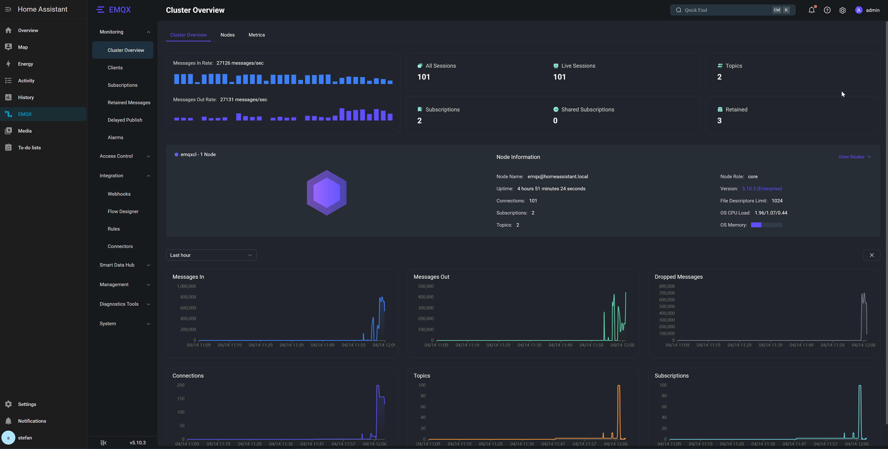

# Home Assistant Community Add-on: EMQX6 Enterprise

[![GitHub Release][releases-shield]][releases]
![Project Stage][project-stage-shield]
[![License][license-shield]](LICENSE.md)

![Supports aarch64 Architecture][aarch64-shield]
![Supports amd64 Architecture][amd64-shield]
[![EMQX Version][emqx-version-shield]][emqx-releases]

[![Github Actions][github-actions-shield]][github-actions]
![Project Maintenance][maintenance-shield]
[![GitHub Activity][commits-shield]][commits]

The most scalable open-source MQTT broker for IoT, IIoT, and connected vehicles. **Enterprise Edition v6.**

## About

[EMQX][emqx] is an Open-source MQTT broker with a high-performance real-time
message processing engine, powering event streaming for IoT devices at massive
scale. As the most scalable MQTT broker, EMQX can help you connect any device,
at any scale (including your home).

The [EMQX MQTT broker][emqx] is an advanced alternative to the Mosquitto MQTT
broker/add-on that is generally used in Home Assistant. It has a UI
to configure, manage, and debug your MQTT broker, clients, and traffic.

This fork runs the **EMQX Enterprise Edition v6** locally and self-hosted on your
Home Assistant instance.

[:books: Read the full add-on documentation][docs]

## Authors & contributors

The original setup of this repository is by [Franck Nijhof][frenck].

The Enterprise Edition v6 fork is maintained by [Stefan Knaak][corgan2222].

For a full list of all authors and contributors,
check [the contributor's page][contributors].

## HA Addon License

MIT License

Copyright (c) 2023-2026 Franck Nijhof
Copyright (c) 2026 Stefan Knaak

Permission is hereby granted, free of charge, to any person obtaining a copy
of this software and associated documentation files (the "Software"), to deal
in the Software without restriction, including without limitation the rights
to use, copy, modify, merge, publish, distribute, sublicense, and/or sell
copies of the Software, and to permit persons to whom the Software is
furnished to do so, subject to the following conditions:

The above copyright notice and this permission notice shall be included in all
copies or substantial portions of the Software.

THE SOFTWARE IS PROVIDED "AS IS", WITHOUT WARRANTY OF ANY KIND, EXPRESS OR
IMPLIED, INCLUDING BUT NOT LIMITED TO THE WARRANTIES OF MERCHANTABILITY,
FITNESS FOR A PARTICULAR PURPOSE AND NONINFRINGEMENT. IN NO EVENT SHALL THE
AUTHORS OR COPYRIGHT HOLDERS BE LIABLE FOR ANY CLAIM, DAMAGES OR OTHER
LIABILITY, WHETHER IN AN ACTION OF CONTRACT, TORT OR OTHERWISE, ARISING FROM,
OUT OF OR IN CONNECTION WITH THE SOFTWARE OR THE USE OR OTHER DEALINGS IN THE
SOFTWARE.

[aarch64-shield]: https://img.shields.io/badge/aarch64-yes-green.svg
[amd64-shield]: https://img.shields.io/badge/amd64-yes-green.svg
[commits-shield]: https://img.shields.io/github/commit-activity/y/corgan2222/addon-emqx6.svg
[commits]: https://github.com/corgan2222/addon-emqx6/commits/main
[contributors]: https://github.com/corgan2222/addon-emqx6/graphs/contributors
[corgan2222]: https://github.com/corgan2222
[docs]: https://github.com/corgan2222/addon-emqx6/blob/main/emqx6/DOCS.md
[emqx]: https://www.emqx.io/
[emqx-releases]: https://github.com/emqx/emqx/releases/
[emqx-version-shield]: https://img.shields.io/badge/EMQX-6.2.0-blue.svg
[frenck]: https://github.com/frenck
[github-actions-shield]: https://github.com/corgan2222/addon-emqx6/actions/workflows/ci.yaml/badge.svg
[github-actions]: https://github.com/corgan2222/addon-emqx6/actions
[license-shield]: https://img.shields.io/github/license/corgan2222/addon-emqx6.svg
[maintenance-shield]: https://img.shields.io/maintenance/yes/2026.svg
[project-stage-shield]: https://img.shields.io/badge/project%20stage-experimental-yellow.svg
[releases-shield]: https://img.shields.io/github/release/corgan2222/addon-emqx6.svg
[releases]: https://github.com/corgan2222/addon-emqx6/releases
[repository]: https://github.com/corgan2222/hassio-addons_repository
